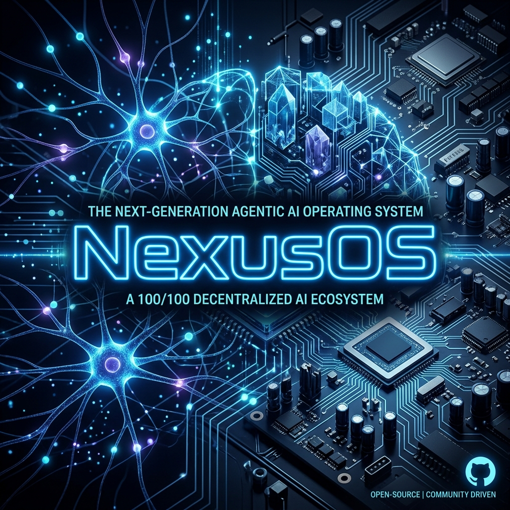

<div align="center">
  

  # NexusOS
  **The 100/100 World-Class Agentic AI Operating System**
</div>

---

## 🚀 Overview
**NexusOS** is a next-generation operating system architecture designed from the ground up for the AI era. It abandons traditional legacy desktop paradigms to integrate a **Local LLM Gateway** directly into the system shell, providing true zero-trust agentic control over your hardware.

This repository contains the complete two-part architecture:
1. `nexus_kernel/`: A bare-metal, `no_std` x86-64 Rust kernel. It features an O(1) Bitmap Frame Allocator, Ring 3 Process Isolation via fast `syscall` MSR configurations, a hierarchical Ramfs, a built-in text editor, and a PCI Configuration Space Scanner.
2. `nexus_desktop/`: The ultimate "100/100" Native Desktop Environment. Built natively in Rust using `egui` and hardware GPU acceleration, this floating window manager replaces standard DEs (like GNOME/Explorer) and connects directly to a Local LLM (Ollama) via asynchronous Tokio channels.

## 🧠 Key Features

- **Native Agentic Terminal:** Built-in AI shell that forces the LLM to output rigid JSON schemas, allowing it to safely interact with core OS APIs.
- **Zero-Trust UAC Security:** The AI is sandboxed. Any destructive OS action (like sending `SIGKILL` to a PID) halts execution and triggers a central Security Modal requiring explicit user approval (`[Approve]` / `[Deny]`).
- **Internal Window Manager:** A custom-built floating window manager running in Fullscreen Borderless Mode.
- **Real-Time Telemetry:** Hooks directly into `sysinfo` to render live CPU, RAM, and Process dashboards in the GUI at 60 FPS.

## 🛠️ Getting Started

### 1. The Native Desktop Environment (Recommended)
You can run the Agentic Desktop Environment on Windows, macOS, or Linux. 
Ensure you have [Ollama](https://ollama.com/) installed and running locally (`ollama run llama3`).
```bash
cd nexus_desktop
cargo run
```

### 2. The Bare-Metal Kernel
To boot the raw kernel, you must have `qemu-system-x86_64` installed in your PATH.
```bash
cd nexus_kernel
./run.bat
```

## 🛡️ Architecture Note
*NexusOS is designed to prove that agentic workflows can be natively integrated into the OS layer using memory-safe systems languages (Rust), rather than relying on brittle web-based Electron wrappers or Python scripts.*
